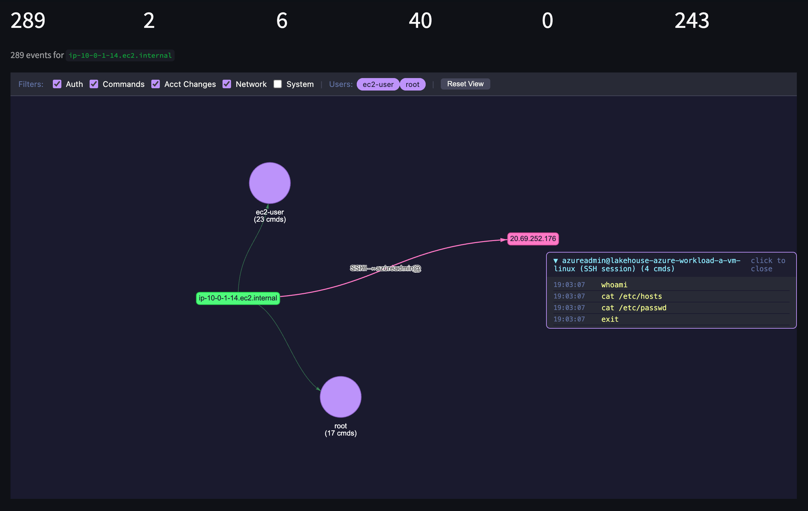
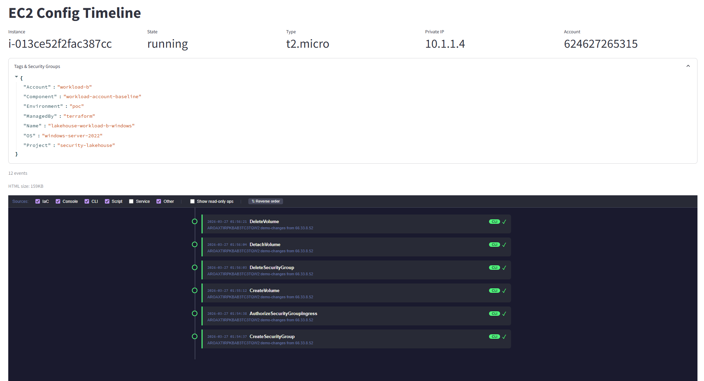

# Security Data Lakehouse

A multi-cloud security data lakehouse that collects security telemetry from AWS, Azure, and GCP, normalizes it into OCSF v1.1.0, and correlates it against threat intelligence — all running on Databricks Free Edition. Includes host-level telemetry collection via Cribl Edge agents deployed to all workload instances.

## Overview

Security teams working across multiple cloud providers and accounts face a common challenge: telemetry is scattered across disparate services and storage backends, each with its own format and access model. Investigating an incident means jumping between consoles, correlating timestamps manually, and hoping nothing slips through the cracks. This project builds a centralized security data lakehouse that pulls all of that into one place.

Terraform deploys the full stack across 3 AWS accounts, an Azure subscription, and a GCP project. Auto Loader ingests security logs from S3, ADLS Gen2, and GCS. The bronze layer normalizes everything into OCSF v1.1.0 format — a common schema that makes cross-cloud analysis possible. The gold layer correlates network flows against threat intelligence feeds (Feodo Tracker, Emerging Threats, IPsum) and forwards matched alerts to SNS within ~10 minutes of the original network event.

Cribl Edge agents run on all 8 workload instances (4 Linux, 4 Windows), collecting host-level telemetry — auth logs, syslog, auditd, bash history, and Windows Event Logs. A Cribl Stream pipeline enriches events with `source_type` metadata, obfuscates sensitive data in bash history, and writes to Hive-partitioned cloud storage. Databricks bronze notebooks ingest this data via Auto Loader and normalize it into OCSF format alongside the cloud-native security logs.

The entire pipeline runs on Databricks Free Edition's Starter Warehouse — no paid compute required. New AWS accounts, Azure subscriptions, or GCP projects can be onboarded via a template-copy workflow with automated scripts, and the project is designed to be forked and adapted.

### At a Glance

| | |
|---|---|
| **Infrastructure** | ~200 Terraform resources across 9 independent roots |
| **Accounts** | 3 AWS accounts + 1 Azure subscription + 1 GCP project |
| **Cloud Data Sources** | CloudTrail, VPC Flow Logs, GuardDuty, AWS Config, Activity Log, VNet Flow Logs, Cloud Audit Logs, GCP VPC Flow Logs, Cloud Asset Inventory, SCC Findings |
| **Host Telemetry** | Cribl Edge on 8 hosts (4 Linux, 4 Windows) — auth logs, syslog, auditd, bash history, Windows Event Logs |
| **Pipeline** | 13 scheduled jobs, 26 notebooks, full Bronze/Silver/Gold medallion |
| **Alert Latency** | ~10 minutes from network flow to SNS notification |
| **Compute** | Databricks Free Edition — Serverless Starter Warehouse |

## Architecture

```mermaid
graph TB
    subgraph DBX ["Databricks (Free Edition)"]
        direction LR
        UC["Unity Catalog<br/>security_poc · bronze/silver/gold/security"]
        DW["Serverless Starter Warehouse"]

        subgraph JOBS ["Scheduled Jobs (13)"]
            J1["CloudTrail"] & J2["VPC Flow + Alerts"] & J3["GuardDuty"]
            J4["Config Pipeline"] & J5["Threat Intel"]
            J6["Activity Log"] & J7["VNet Flow + Alerts"]
            J8["GCP Audit Logs"] & J9["GCP VPC Flow + Alerts"]
            J10["GCP Asset Inventory"] & J11["GCP SCC Findings"]
            J12["Host Telemetry Linux"] & J13["Host Telemetry Windows"]
        end

        subgraph CREDS ["Storage Credentials"]
            HC["hub-credential<br/>(AWS IAM)"]
            MC["managed-credential<br/>(AWS IAM)"]
            AZC["azure-credential<br/>(Entra ID SP)"]
            GCPCRED["gcp-credential<br/>(SA Key)"]
        end
    end

    subgraph CRIBL ["Cribl Cloud"]
        STREAM["Stream Worker<br/>Routes · S3 partitionExpr"]
        FLEET["Edge Fleet<br/>default_fleet · 8 agents"]
    end

    subgraph SEC ["AWS Security Account"]
        HUB["Hub IAM Role"] & MSR["Managed Storage Role"]
        S3M["S3: Managed Storage"] & SNS["SNS Alerts"]
    end

    subgraph WK ["AWS Workload Accounts (A, B)"]
        EC2["VPC + EC2 instances<br/>+ Cribl Edge"]
        DS_AWS["CloudTrail · VPC Flow · GuardDuty · Config"]
        S3W["S3: Security Logs"]
        S3HT["S3: Host Telemetry"]
        RO["Read-Only Role"]
    end

    subgraph AZ ["Azure Workload (A)"]
        VMS["VNet + VMs<br/>+ Cribl Edge"]
        DS_AZ["Activity Log · VNet Flow Logs"]
        ADLS["ADLS Gen2: Security Logs + Host Telemetry"]
    end

    subgraph GCP ["GCP Workload (A)"]
        GCPVMS["VPC + VMs<br/>+ Cribl Edge"]
        DS_GCP["Cloud Audit · VPC Flow · Asset Inventory · SCC"]
        GCS["GCS: Security Logs + Host Telemetry"]
    end

    HC -.->|"AssumeRole"| HUB
    MC -.->|"AssumeRole"| MSR
    HUB -.->|"AssumeRole"| RO
    RO -.->|"S3 read"| S3W & S3HT
    MSR -.->|"S3 read/write"| S3M
    AZC -.->|"Entra ID"| ADLS
    GCPCRED -.->|"SA Key"| GCS
    EC2 -.-> DS_AWS -->|"logs"| S3W
    VMS -.-> DS_AZ -->|"logs"| ADLS
    GCPVMS -.-> DS_GCP -->|"logs"| GCS
    EC2 -->|"auth·syslog·auditd<br/>bash_history"| FLEET
    VMS -->|"auth·syslog·auditd"| FLEET
    GCPVMS -->|"auth·syslog·auditd"| FLEET
    FLEET -->|"TCP/TLS"| STREAM
    STREAM -->|"Hive partitioned<br/>source_type=X/dt=Y"| S3HT
    J2 & J7 & J9 -->|"sns:Publish"| SNS
    JOBS -->|"Auto Loader"| CREDS
    J12 & J13 -->|"Auto Loader"| S3HT
```



For detailed diagrams (IAM trust chains, data flow, Terraform dependency graph), see [architecture_diagram.md](architecture_diagram.md).

## How It Works

**Ingestion (Bronze)** — Scheduled jobs run Auto Loader against S3, ADLS Gen2, and GCS via Unity Catalog external locations. Each data source has its own notebook that normalizes raw logs into OCSF v1.1.0 format — CloudTrail, VPC Flow Logs, GuardDuty, and AWS Config from AWS; Activity Log and VNet Flow Logs from Azure; Cloud Audit Logs, VPC Flow Logs, Cloud Asset Inventory, and SCC Findings from GCP. A separate threat intel pipeline fetches IOC feeds (Feodo Tracker, Emerging Threats, IPsum) daily. Host telemetry from Cribl Edge agents (auth logs, syslog, auditd, bash history, Windows Event Logs) is ingested from Hive-partitioned cloud storage and normalized into OCSF format. Ingestion cadence is 10-15 minutes for security logs and host telemetry, daily for threat intel.

**Enrichment (Silver)** — AWS Config snapshots are processed into CDC rows that track per-resource changes over time. Threat intel IOCs are deduplicated via MERGE with TTL-based expiration, keeping the network IOC table current without unbounded growth.

**Detection (Gold)** — Network flows from AWS VPC Flow Logs, Azure VNet Flow Logs, and GCP VPC Flow Logs are joined against threat intel IOCs on destination IP using an incremental watermark. Matches become alerts via MERGE on `alert_id`. A forwarding notebook reads new alerts via Delta Change Data Feed and publishes to SNS — ~10-minute end-to-end latency. OCSF normalization is the key enabler here: the same gold alerts notebook works across all three clouds without any branching logic.

## Security Investigation

The pipeline doesn't just collect and normalize data — it powers interactive investigation tools for security analysis. These tools run as a Streamlit Databricks App with no additional infrastructure required.

### Host Investigation Graph



Interactive vis.js network graph for host-centric security triage. Select a host and time window to see a hierarchical graph of users, authentication sources, process executions, network connections, and SSH lateral movement. Click any user node to expand a collapsible command panel showing every command they ran. SSH session correlation follows lateral movement to show what commands were executed on remote hosts during each session. Client-side filtering by event category (auth, commands, network, account changes, system events) and per-user toggles let you focus the graph without reloading. Dark theme (Dracula palette).

Data sources: `silver.host_authentications`, `silver.host_process_executions`, `silver.host_account_changes`, `silver.host_system_events`, `gold.ec2_inventory`.

### EC2 Config Timeline



Vertical timeline of every API call and configuration change for a specific EC2 instance. CloudTrail events are classified by source — IaC (Terraform), Console, CLI, SDK, or AWS Service — with color-coded badges. AWS Config CDC events show configuration changes with INSERT/UPDATE/DELETE pills. Service polling (Describe* calls from AWS Config) is automatically collapsed into summary groups. Filters let you toggle source types, hide read-only operations, and reverse sort order — all client-side.

Data sources: `bronze.cloudtrail`, `silver.config_cdc`, `gold.ec2_inventory`.

### Threat Intel Correlation

Automated matching of network flows against threat intelligence feeds (Feodo Tracker, Emerging Threats, IPsum). The gold layer joins VPC Flow Logs from all three clouds against IOCs on destination IP. Matched alerts are forwarded to SNS within ~10 minutes of the original network event. OCSF normalization enables a single detection notebook to work across AWS, Azure, and GCP without branching logic.

Data sources: `bronze.threat_intel_raw`, `silver.threat_intel_network_iocs`, `bronze.vpc_flow`, `gold.alerts`.

### Investigation Notebooks

Gold-layer Databricks notebooks for on-demand investigation. Timeline materialization builds a scored activity timeline for a host, with relevance scoring (0–100) based on proximity to a trigger event. Identity chain discovery follows privilege escalation paths (sudo, su, runas) to map the full user transition chain.

Data sources: all `silver.host_*` tables → `gold.user_activity_timeline`.

For detailed feature descriptions and data sources, see [Investigation Capabilities](docs/investigation-capabilities.md).

## Project Structure

```
security-data-lakehouse/
├── ansible/                            # Cribl Edge deployment (Ansible roles + inventory)
│   ├── roles/cribl-edge-linux/         # Linux Edge bootstrap (root, auditd)
│   ├── roles/cribl-edge-windows/       # Windows Edge MSI install
│   └── inventory/                      # Dynamic inventory from Terraform outputs
├── bootstrap/                          # State backend (S3 + DynamoDB, local state)
├── foundations/
│   ├── aws-security/                   # Managed S3, KMS, SNS alerts
│   ├── azure-security/                 # Entra ID service principal, ADLS Gen2 managed storage
│   └── gcp-security/                   # GCP service account, key, API enablement
├── workloads/
│   ├── _template-aws/                  # Template for new AWS workload accounts
│   ├── _template-azure/                # Template for new Azure workload subscriptions
│   ├── _template-gcp/                  # Template for new GCP workload projects
│   ├── aws-workload-a/                 # VPC, EC2, CloudTrail, Flow Logs, GuardDuty, Config
│   ├── aws-workload-b/                 # Same pattern, independent account
│   ├── azure-workload-a/              # VNet, VMs, Activity Log, VNet Flow Logs
│   └── gcp-workload-a/                # VPC, VMs, Cloud Audit, VPC Flow, Asset Inventory, SCC
├── hub/                                # Databricks integration (IAM, storage creds, UC, jobs)
├── modules/
│   ├── aws/                            # security-foundation, workload-baseline, data-sources
│   ├── azure/                          # security-foundation, workload-baseline, data-sources
│   ├── gcp/                            # security-foundation, workload-baseline, data-sources
│   └── databricks/                     # cloud-integration, unity-catalog, workspace-config, jobs
├── notebooks/
│   ├── bronze/aws/                     # OCSF common + CloudTrail, VPC Flow, GuardDuty, Config
│   ├── bronze/azure/                   # Azure common + Activity Log, VNet Flow
│   ├── bronze/gcp/                     # GCP common + Cloud Audit, VPC Flow, Asset Inventory, SCC
│   ├── bronze/host_telemetry/          # Host common + auth, syslog, auditd, commands, Windows events
│   ├── silver/                         # Config CDC
│   ├── gold/                           # EC2 inventory, alerts, alert forwarding
│   └── security/threat_intel/          # TI feed ingest + silver network IOCs
├── scripts/
│   ├── cribl-config/                   # Cribl fleet/stream JSON configs (sources, pipelines, destinations)
│   ├── configure-cribl.sh              # Cribl Cloud REST API fallback (no MCP dependency)
│   ├── assemble-workloads.sh           # Collect workload outputs → hub/workloads.auto.tfvars.json
│   └── apply-all.sh                    # Automated Terraform sequencing
├── diagrams/                           # Mermaid source files (4 diagrams)
└── docs/                               # Pipeline docs and incident/operations playbooks
```

## Getting Started

### Prerequisites

| Requirement | Detail |
|-------------|--------|
| **AWS Organization** | 3+ member accounts with `OrganizationAccountAccessRole` |
| **Azure subscription** | At least 1, with Contributor access |
| **GCP project** | At least 1, with Editor access |
| **Databricks workspace** | Free Edition or higher — a workspace URL and PAT |
| **Terraform** | >= 1.5, < 2.0 |
| **AWS CLI** | v2, credentials configured for the security account |
| **Azure CLI** | v2, authenticated to the target tenant |
| **gcloud CLI** | v2, authenticated to the target GCP project |

#### Provider Versions

| Provider | Version |
|----------|---------|
| hashicorp/aws | ~> 5.50 |
| databricks/databricks | ~> 1.50 |
| hashicorp/tls | ~> 4.0 |
| hashicorp/azurerm | ~> 4.0 |
| hashicorp/azuread | ~> 2.0 |
| hashicorp/google | ~> 5.0 |

### Deploy

Each root is applied independently in dependency order:

| Step | Root | Notes |
|------|------|-------|
| 1 | `bootstrap/` | `terraform init && terraform apply` (local state) |
| 2 | `foundations/aws-security/` | All foundations parallel OK |
| 2 | `foundations/azure-security/` | All foundations parallel OK |
| 2 | `foundations/gcp-security/` | All foundations parallel OK |
| 3 | `workloads/aws-workload-a/` | All workloads parallel OK |
| 3 | `workloads/aws-workload-b/` | |
| 3 | `workloads/azure-workload-a/` | Requires `foundations/azure-security/` |
| 3 | `workloads/gcp-workload-a/` | Requires `foundations/gcp-security/` |
| 4 | `scripts/assemble-workloads.sh` | Collects workload outputs → `hub/workloads.auto.tfvars.json` |
| 5 | `hub/` | `terraform init && terraform apply` |

Or run `./scripts/apply-all.sh` for automated sequencing.

> **Note:** Set the Databricks PAT via environment variable — never commit it to tfvars.
> ```bash
> export TF_VAR_databricks_pat="dapi..."
> ```

### Validate

```bash
terraform fmt -check -recursive
terraform validate
terraform plan    # Should show no changes
```

## Adding Workloads

The architecture supports any number of workload accounts, subscriptions, and projects.

### AWS

Copy `workloads/_template-aws/` to `workloads/aws-workload-<name>/`, fill in `terraform.tfvars` with the account ID and VPC CIDR, configure `backend.tf`, and apply. Then re-run `scripts/assemble-workloads.sh` and `terraform apply` in `hub/`. See [onboarding_new_aws_accounts.md](onboarding_new_aws_accounts.md) for the full guide or use [onboard_workload_account.sh](onboard_workload_account.sh) for automation.

### Azure

Copy `workloads/_template-azure/` to `workloads/azure-workload-<name>/`, fill in `terraform.tfvars` with the subscription ID and VNet CIDR, configure `backend.tf`, and apply. Requires `foundations/azure-security/` applied first (for the service principal ID). Same assemble + hub re-apply flow. See [onboarding_new_azure_accounts.md](onboarding_new_azure_accounts.md) for the full guide or use [onboard_azure_workload.sh](onboard_azure_workload.sh) for automation.

### GCP

Copy `workloads/_template-gcp/` to `workloads/gcp-workload-<name>/`, fill in `terraform.tfvars` with the GCP project ID, region, and VPC CIDR, configure `backend.tf`, and apply. Requires `foundations/gcp-security/` applied first (for the service account email). Same assemble + hub re-apply flow. See [onboarding_new_gcp_accounts.md](onboarding_new_gcp_accounts.md) for the full guide or use [onboard_gcp_workload.sh](onboard_gcp_workload.sh) for automation.

## Documentation

| Document | Description |
|----------|-------------|
| [architecture_diagram.md](architecture_diagram.md) | 4 Mermaid diagrams — architecture, access chains, data flow, Terraform roots |
| [docs/threat-intel-alert-pipeline.md](docs/threat-intel-alert-pipeline.md) | TI pipeline architecture and CDF redesign rationale |
| [docs/playbooks/ti-network-alert-response.md](docs/playbooks/ti-network-alert-response.md) | Incident response playbook |
| [docs/playbooks/pipeline-operations.md](docs/playbooks/pipeline-operations.md) | Operations runbook |
| [onboarding_new_aws_accounts.md](onboarding_new_aws_accounts.md) | Guide for adding AWS workload accounts |
| [onboarding_new_azure_accounts.md](onboarding_new_azure_accounts.md) | Guide for adding Azure workload subscriptions |
| [onboarding_new_gcp_accounts.md](onboarding_new_gcp_accounts.md) | Guide for adding GCP workload projects |
| [onboard_workload_account_usage.md](onboard_workload_account_usage.md) | AWS onboarding automation script usage |
| [onboard_azure_workload_usage.md](onboard_azure_workload_usage.md) | Azure onboarding automation script usage |
| [onboard_gcp_workload_usage.md](onboard_gcp_workload_usage.md) | GCP onboarding automation script usage |
| [docs/investigation-capabilities.md](docs/investigation-capabilities.md) | Investigation tools — Host Graph, EC2 Timeline, Threat Intel, Notebooks |

## Databricks Free Edition Notes

This project runs entirely on Databricks Free Edition (permanent, not a trial):

| Feature | Status |
|---------|--------|
| Unity Catalog | Works |
| Serverless Starter Warehouse | Works (single warehouse, auto-managed) |
| Auto Loader (cloudFiles) | Works via serverless |
| Delta tables | Works |
| Classic clusters | Not available |
| Multiple warehouses | Not available |
| Account-level API | Not available |

The **Starter Warehouse** is the single compute resource. All 13 scheduled jobs (spanning AWS, Azure, GCP workloads, and host telemetry) and all interactive queries share it. To enable classic clusters, add `enable_cluster = true` in the workspace config module (requires a paid plan).

## License

Licensed under the Apache License, Version 2.0. See [LICENSE](LICENSE) for details.
