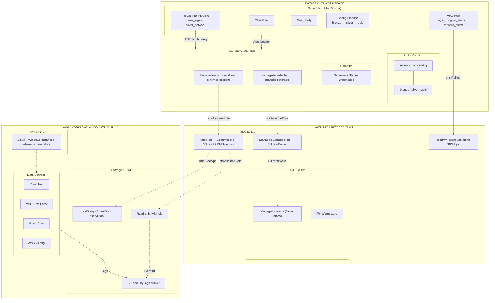

# Security Data Lakehouse

Multi-account AWS security data lakehouse powered by Databricks and Terraform.

## Overview

This project deploys a complete security data lakehouse across multiple AWS accounts using Databricks Unity Catalog. It collects security telemetry (CloudTrail, VPC Flow Logs, GuardDuty, AWS Config) from workload accounts and centralizes it into a Databricks lakehouse for analysis.

- **102 Terraform resources** across 9 deployment phases
- **3 AWS accounts** — 1 security/management hub + 2 workload accounts (extensible)
- **4 security data sources** per workload account + 3 external threat intel feeds
- **Full medallion architecture** — Bronze (Auto Loader + TI feeds), Silver (Config CDC + TI network IOCs), Gold (EC2 inventory + correlated alerts)
- **Threat intel alert pipeline** — IOC correlation against VPC Flow Logs, ~10-min alert latency, SNS forwarding
- **Databricks Free Edition compatible** — runs entirely on the Starter Warehouse

## Architecture



### Account Topology

| Account | Role |
|---------|------|
| **Security / Management** | Terraform state (S3 + DynamoDB), hub IAM role, Databricks managed storage |
| **Workload A** | VPC, EC2 instances, CloudTrail, VPC Flow Logs, GuardDuty, AWS Config |
| **Workload B** | Same as Workload A (independent account, independent data sources) |

Additional workload accounts can be onboarded using the included automation script.

### Data Flow

1. **EC2 instances** in workload accounts generate security telemetry
2. **AWS services** (CloudTrail, VPC Flow Logs, GuardDuty, Config) write logs to per-account S3 buckets
3. **Databricks hub role** in the security account chain-assumes into read-only roles in each workload account
4. **Auto Loader jobs** read from workload S3 buckets via external locations and write to **Bronze** Delta tables (every 10–15 min)
5. **Threat Intel Pipeline** fetches IOC feeds (Feodo Tracker, Emerging Threats, IPsum) daily → `bronze.threat_intel_raw` → MERGE into `silver.threat_intel_network`
6. **Silver CDC** normalizes Config snapshots into per-resource change-tracking rows
7. **Gold EC2 inventory** joins EC2 instances with related resources (ENIs, volumes, security groups) into a current-state table
8. **Gold alerts** (every 10 min) joins `bronze.vpc_flow_raw` against `silver.threat_intel_network` on destination IP using an incremental watermark — new matches appended via MERGE on `alert_id`
9. **Alert forwarding** reads only new inserts via Delta Change Data Feed and publishes to **SNS** (`security-lakehouse-alerts`) — ~10-min end-to-end alert latency
10. **Unity Catalog** provides governance across bronze/silver/gold schemas

## Documentation

| Document | Description |
|----------|-------------|
| [docs/threat-intel-alert-pipeline.md](docs/threat-intel-alert-pipeline.md) | Architecture and design rationale for the TI pipeline — medallion layers, latency tradeoffs, CDF redesign |
| [docs/playbooks/ti-network-alert-response.md](docs/playbooks/ti-network-alert-response.md) | Incident response playbook — how to triage, investigate, and contain a `ti_network` alert |
| [docs/playbooks/pipeline-operations.md](docs/playbooks/pipeline-operations.md) | Operations runbook — feed failures, CDF watermark triage, manual trigger procedures, weekly reconciliation |
| [architecture_diagram.md](architecture_diagram.md) | Full architecture diagrams — high-level, IAM chain, data flow, Terraform module graph |

## Prerequisites

| Requirement | Detail |
|-------------|--------|
| **AWS Organization** | 3+ member accounts with `OrganizationAccountAccessRole` |
| **Databricks workspace** | Free Edition or higher — a workspace URL and PAT |
| **Terraform** | >= 1.5, < 2.0 |
| **AWS CLI** | v2 with credentials configured for the security account |

### Provider Versions

| Provider | Version |
|----------|---------|
| hashicorp/aws | ~> 5.50 |
| databricks/databricks | ~> 1.50 |
| hashicorp/tls | ~> 4.0 |

## Getting Started

### 1. Clone and configure

```bash
git clone <repo-url>
cd security-data-lakehouse

# Configure backend
cp environments/poc/backend.tf.example environments/poc/backend.tf
# Edit backend.tf — set your S3 bucket name and region

# Configure variables
cp environments/poc/terraform.tfvars.example environments/poc/terraform.tfvars
# Edit terraform.tfvars — set account IDs, workspace URL, etc.

# Set the Databricks PAT via environment variable (never in tfvars)
export TF_VAR_databricks_pat="dapi..."
```

### 2. Bootstrap the state backend

```bash
cd bootstrap/
terraform init
terraform apply
```

This creates the S3 bucket and DynamoDB table for remote state. Uses local state (by design — the remote backend can't exist before this runs).

### 3. Deploy the multi-root architecture

Each root is applied independently in order:

| Step | Root | Command |
|------|------|---------|
| 1 | `bootstrap/` | Already done above |
| 2 | `foundations/aws-security/` | `cd foundations/aws-security/ && terraform init && terraform apply` |
| 3 | `workloads/aws-workload-a/` | `cd workloads/aws-workload-a/ && terraform init && terraform apply` (parallel OK) |
| 3 | `workloads/aws-workload-b/` | `cd workloads/aws-workload-b/ && terraform init && terraform apply` (parallel OK) |
| 4 | Assemble workload outputs | `./scripts/assemble-workloads.sh` |
| 5 | `hub/` | `cd hub/ && terraform init && terraform apply` |

Or use `./scripts/apply-all.sh` for automated sequencing.

### 4. Validate

```bash
terraform fmt -check -recursive ../..
terraform validate
terraform plan    # Should show no changes
```

## Project Structure

```
security-data-lakehouse/
├── bootstrap/                          # Step 1: State backend (local state)
│   ├── main.tf                         #   S3 bucket + DynamoDB table
│   ├── outputs.tf
│   ├── versions.tf
│   └── validate.sh                     #   Post-apply validation script
│
├── foundations/
│   └── aws-security/                   # Step 2: Security account foundation
│       ├── main.tf                     #   S3 managed storage, KMS, SNS alerts
│       ├── variables.tf
│       ├── outputs.tf
│       └── backend.tf.example
│
├── workloads/
│   ├── _template-aws/                  # Template for new workload accounts
│   ├── aws-workload-a/                 # Step 3: Workload account A
│   │   ├── main.tf                     #   VPC, EC2, data sources
│   │   ├── variables.tf
│   │   ├── outputs.tf
│   │   └── backend.tf.example
│   └── aws-workload-b/                 # Step 3: Workload account B
│
├── hub/                                # Step 5: Databricks integration hub
│   ├── main.tf                         #   IAM roles, storage creds, Unity Catalog, jobs
│   ├── variables.tf
│   ├── outputs.tf
│   ├── backend.tf.example
│   └── workloads.auto.tfvars.json      #   Generated by assemble-workloads.sh
│
├── scripts/
│   ├── assemble-workloads.sh           # Step 4: Collect workload outputs → hub
│   └── apply-all.sh                    #   Automated full apply sequence
│
├── environments/poc/                   # (deprecated) Original monolith root
│
├── modules/
│   ├── aws/
│   │   ├── security-foundation/        #   S3 managed storage, KMS, SNS
│   │   ├── workload-account-baseline/  #   VPC, EC2, security groups, SSH keys
│   │   └── data-sources/               #   CloudTrail, Flow Logs, GuardDuty, Config
│   │
│   └── databricks/
│       ├── cloud-integration/          #   Storage credentials, external locations
│       ├── unity-catalog/              #   Catalog, schemas
│       ├── workspace-config/           #   Starter Warehouse
│       └── jobs/                       #   Bronze ingestion jobs
│
├── notebooks/
│   ├── bronze/aws/                     #   Auto Loader notebooks (4 data sources)
│   ├── silver/                         #   Silver CDC notebooks
│   ├── gold/                           #   Gold analytical notebooks
│   └── security/threat_intel/          #   Threat intel feed notebooks
│
├── diagrams/                           #   Architecture diagrams (Mermaid sources)
├── docs/                               #   Pipeline docs and playbooks
└── architecture_diagram.md             #   Detailed architecture with inline diagrams
```

## Adding Workload Accounts

The architecture supports any number of workload accounts via the template-copy workflow:

1. Copy `workloads/_template-aws/` to `workloads/aws-workload-<name>/`
2. Fill in `terraform.tfvars` with the account ID, VPC CIDR, etc.
3. Configure `backend.tf` from the example
4. Run `terraform init && terraform apply`
5. Re-run `scripts/assemble-workloads.sh` and `terraform apply` in `hub/`

## Databricks Free Edition Notes

This project runs entirely on Databricks Free Edition (permanent, not a trial):

| Feature | Status |
|---------|--------|
| Unity Catalog | Works |
| Serverless Starter Warehouse | Works (single warehouse, auto-managed) |
| Auto Loader (cloudFiles) | Works via serverless |
| Delta tables | Works |
| Classic clusters | Not available |
| Multiple warehouses | Not available |
| Account-level API | Not available |

The **Starter Warehouse** is the single compute resource. All 4 ingestion jobs and all interactive queries share it. To enable classic clusters, add `enable_cluster = true` in the workspace config module (requires a paid plan).

## Documentation

| Document | Description |
|----------|-------------|
| [architecture_diagram.md](architecture_diagram.md) | Detailed architecture with 4 Mermaid diagrams |
| [onboarding_new_aws_accounts.md](onboarding_new_aws_accounts.md) | Step-by-step guide for adding workload accounts |
| [onboard_workload_account_usage.md](onboard_workload_account_usage.md) | Usage guide for the onboarding automation script |
| [diagrams/](diagrams/) | Mermaid source files for architecture diagrams |

## License

Licensed under the Apache License, Version 2.0. See [LICENSE](LICENSE) for details.
