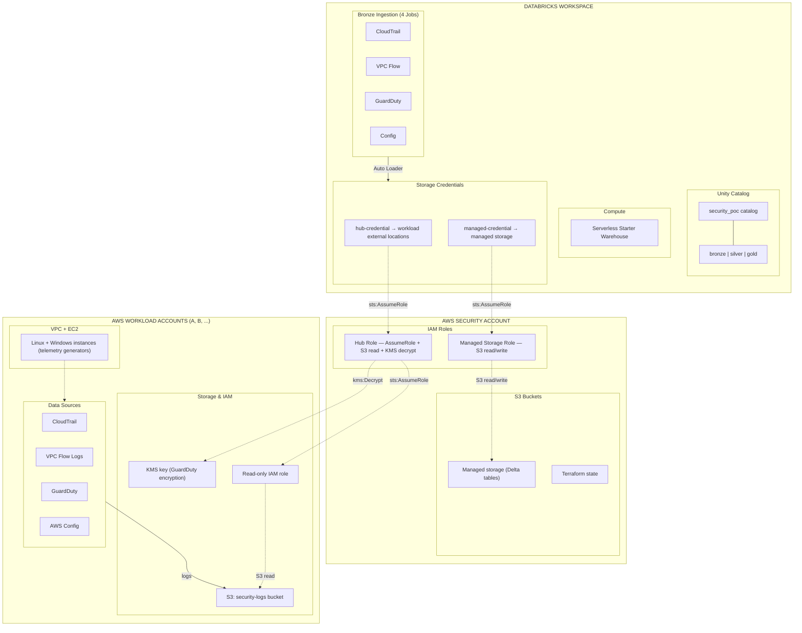

# Security Data Lakehouse

Multi-account AWS security data lakehouse powered by Databricks and Terraform.

## Overview

This project deploys a complete security data lakehouse across multiple AWS accounts using Databricks Unity Catalog. It collects security telemetry (CloudTrail, VPC Flow Logs, GuardDuty, AWS Config) from workload accounts and centralizes it into a Databricks lakehouse for analysis.

- **90 Terraform resources** across 9 deployment phases
- **3 AWS accounts** — 1 security/management hub + 2 workload accounts (extensible)
- **4 security data sources** per workload account
- **Bronze layer ingestion** via Databricks Auto Loader with serverless compute
- **Databricks Free Edition compatible** — runs entirely on the Starter Warehouse

## Architecture



### Account Topology

| Account | Role |
|---------|------|
| **Security / Management** | Terraform state (S3 + DynamoDB), hub IAM role, Databricks managed storage |
| **Workload A** | VPC, EC2 instances, CloudTrail, VPC Flow Logs, GuardDuty, AWS Config |
| **Workload B** | Same as Workload A (independent account, independent data sources) |

Additional workload accounts can be onboarded using the included automation script.

### Data Flow

1. **EC2 instances** in workload accounts generate security telemetry
2. **AWS services** (CloudTrail, VPC Flow Logs, GuardDuty, Config) write logs to per-account S3 buckets
3. **Databricks hub role** in the security account chain-assumes into read-only roles in each workload account
4. **Auto Loader jobs** read from workload S3 buckets via external locations and write to Bronze Delta tables
5. **Unity Catalog** provides governance across bronze/silver/gold schemas

## Prerequisites

| Requirement | Detail |
|-------------|--------|
| **AWS Organization** | 3+ member accounts with `OrganizationAccountAccessRole` |
| **Databricks workspace** | Free Edition or higher — a workspace URL and PAT |
| **Terraform** | >= 1.5, < 2.0 |
| **AWS CLI** | v2 with credentials configured for the security account |

### Provider Versions

| Provider | Version |
|----------|---------|
| hashicorp/aws | ~> 5.50 |
| databricks/databricks | ~> 1.50 |
| hashicorp/tls | ~> 4.0 |

## Getting Started

### 1. Clone and configure

```bash
git clone <repo-url>
cd security-data-lakehouse

# Configure backend
cp environments/poc/backend.tf.example environments/poc/backend.tf
# Edit backend.tf — set your S3 bucket name and region

# Configure variables
cp environments/poc/terraform.tfvars.example environments/poc/terraform.tfvars
# Edit terraform.tfvars — set account IDs, workspace URL, etc.

# Set the Databricks PAT via environment variable (never in tfvars)
export TF_VAR_databricks_pat="dapi..."
```

### 2. Bootstrap the state backend

```bash
cd bootstrap/
terraform init
terraform apply
```

This creates the S3 bucket and DynamoDB table for remote state. Uses local state (by design — the remote backend can't exist before this runs).

### 3. Deploy the main environment (staged apply)

```bash
cd environments/poc/
terraform init
terraform apply    # Apply all phases, or use staged apply below
```

#### Staged Apply Sequence

For the initial deployment, a staged apply ensures dependencies are met at each phase:

| Phase | Description | Target |
|-------|-------------|--------|
| 1-2 | Bootstrap (already done) | `bootstrap/` |
| 3 | Security account baseline + workload baselines | `-target=module.security_account_baseline -target=module.workload_a_baseline -target=module.workload_b_baseline` |
| 4 | Data sources (CloudTrail, Flow Logs, GuardDuty, Config) | `-target=module.workload_a_data_sources -target=module.workload_b_data_sources` |
| 5 | Databricks cloud integration (storage credentials, external locations) | `-target=module.cloud_integration` |
| 5.5 | Enable self-assume | Set `enable_self_assume = true` in tfvars, then `terraform apply` |
| 6 | Unity Catalog (catalog, schemas) | `-target=module.unity_catalog` |
| 7 | Workspace config (Starter Warehouse) | `-target=module.workspace_config` |
| 8 | Bronze ingestion (jobs + notebooks) | `-target=module.bronze_ingestion` |
| 9 | Full apply | `terraform apply` (validates everything) |

### 4. Validate

```bash
terraform fmt -check -recursive ../..
terraform validate
terraform plan    # Should show no changes
```

## Project Structure

```
security-data-lakehouse/
├── bootstrap/                          # Phase 1-2: State backend (local state)
│   ├── main.tf                         #   S3 bucket + DynamoDB table
│   ├── outputs.tf
│   ├── versions.tf
│   └── validate.sh                     #   Post-apply validation script
│
├── environments/poc/                   # Phases 3-9: Root module
│   ├── backend.tf.example              #   S3 backend template
│   ├── terraform.tfvars.example        #   Variable values template
│   ├── versions.tf                     #   Terraform + provider versions
│   ├── providers.tf                    #   4 providers: aws (x3) + databricks
│   ├── variables.tf                    #   All input variables
│   ├── locals.tf                       #   Common tags, naming, derived values
│   ├── main.tf                         #   Module wiring (all 9 phases)
│   ├── outputs.tf                      #   Key resource identifiers
│   └── validate-phase*.sh              #   Per-phase validation scripts
│
├── modules/
│   ├── aws/
│   │   ├── security-account-baseline/  #   Hub IAM roles, managed S3/KMS
│   │   ├── workload-account-baseline/  #   VPC, EC2, security groups, SSH keys
│   │   └── data-sources/               #   CloudTrail, Flow Logs, GuardDuty, Config
│   │
│   └── databricks/
│       ├── cloud-integration/          #   Storage credentials, external locations
│       ├── unity-catalog/              #   Catalog, schemas
│       ├── workspace-config/           #   Starter Warehouse
│       └── jobs/                       #   Bronze ingestion jobs
│
├── notebooks/
│   └── bronze/                         #   Auto Loader notebooks (4 data sources)
│       ├── 01_bronze_cloudtrail.py
│       ├── 02_bronze_vpc_flow.py
│       ├── 03_bronze_guardduty.py
│       └── 04_bronze_config.py
│
├── diagrams/                           #   Architecture diagrams (Mermaid sources)
│   ├── 01_high_level_architecture.mmd
│   ├── 02_iam_trust_chain.mmd
│   ├── 03_data_flow.mmd
│   └── 04_terraform_modules.mmd
│
├── onboard_workload_account.sh         #   Automation: add a new workload account
├── onboarding_new_aws_accounts.md      #   Guide: add a new workload account
├── onboard_workload_account_usage.md   #   Usage guide for the onboarding script
└── architecture_diagram.md             #   Detailed architecture with inline diagrams
```

## Adding Workload Accounts

The architecture supports any number of workload accounts. Each new account adds ~27 Terraform resources and requires modifications to 16 files.

**Automated:** Run the onboarding script:
```bash
./onboard_workload_account.sh \
  --alias workload-c \
  --account-id 123456789012 \
  --vpc-cidr 10.2.0.0/16 \
  --subnet-cidr 10.2.1.0/24
```

See [onboarding_new_aws_accounts.md](onboarding_new_aws_accounts.md) for the full guide and [onboard_workload_account_usage.md](onboard_workload_account_usage.md) for script details.

## Databricks Free Edition Notes

This project runs entirely on Databricks Free Edition (permanent, not a trial):

| Feature | Status |
|---------|--------|
| Unity Catalog | Works |
| Serverless Starter Warehouse | Works (single warehouse, auto-managed) |
| Auto Loader (cloudFiles) | Works via serverless |
| Delta tables | Works |
| Classic clusters | Not available |
| Multiple warehouses | Not available |
| Account-level API | Not available |

The **Starter Warehouse** is the single compute resource. All 4 ingestion jobs and all interactive queries share it. To enable classic clusters, add `enable_cluster = true` in the workspace config module (requires a paid plan).

## Documentation

| Document | Description |
|----------|-------------|
| [architecture_diagram.md](architecture_diagram.md) | Detailed architecture with 4 Mermaid diagrams |
| [onboarding_new_aws_accounts.md](onboarding_new_aws_accounts.md) | Step-by-step guide for adding workload accounts |
| [onboard_workload_account_usage.md](onboard_workload_account_usage.md) | Usage guide for the onboarding automation script |
| [diagrams/](diagrams/) | Mermaid source files for architecture diagrams |

## License

Licensed under the Apache License, Version 2.0. See [LICENSE](LICENSE) for details.
