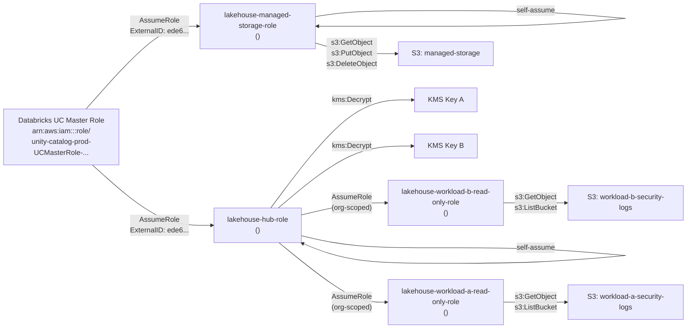
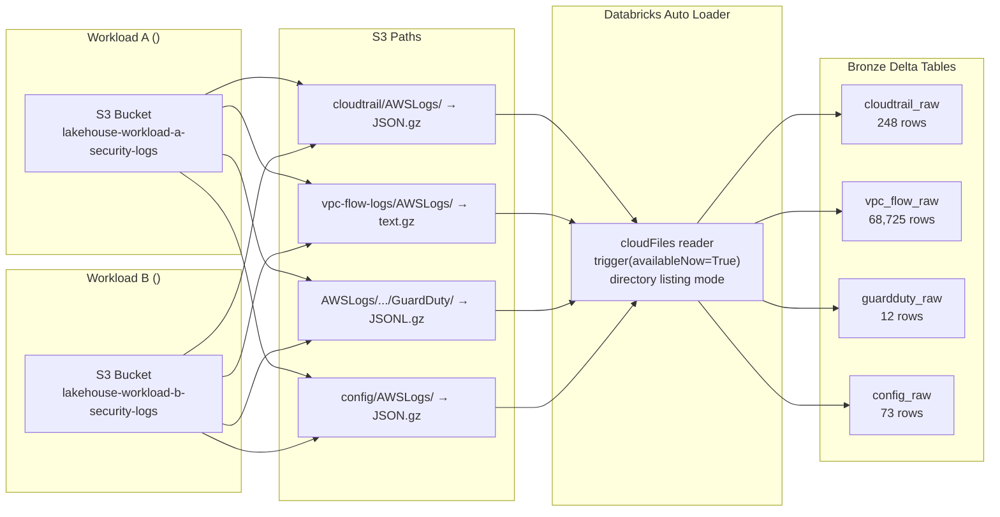
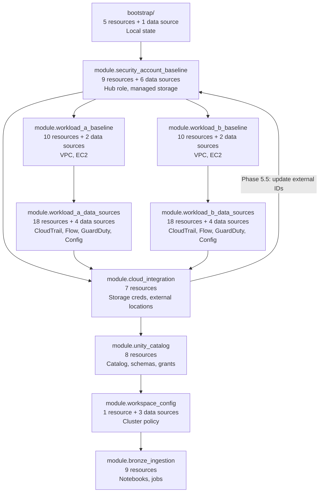

# Architecture Diagram — Security Data Lakehouse

Generated from Terraform state (111 entries: 90 resources + 21 data sources)

## High-Level Architecture

```mermaid
graph TB
    subgraph "Databricks (Free Edition)"
        direction TB
        DW["Serverless Starter Warehouse<br/><WAREHOUSE_ID>"]

        subgraph "Unity Catalog"
            CAT["Catalog: security_poc"]
            SB["Schema: bronze"]
            SS["Schema: silver"]
            SG["Schema: gold"]
            CAT --> SB
            CAT --> SS
            CAT --> SG
        end

        subgraph "Bronze Ingestion Jobs"
            J1["CloudTrail Job<br/>15min trigger, PAUSED"]
            J2["VPC Flow Job<br/>10min trigger, PAUSED"]
            J3["GuardDuty Job<br/>6hr trigger, PAUSED"]
            J4["Config Job<br/>24hr trigger, PAUSED"]
        end

        subgraph "Notebooks"
            N1["01_bronze_cloudtrail.py"]
            N2["02_bronze_vpc_flow.py"]
            N3["03_bronze_guardduty.py"]
            N4["04_bronze_config.py"]
        end

        subgraph "Storage Credentials"
            HC["lakehouse-hub-credential"]
            MC["lakehouse-managed-credential"]
        end

        subgraph "External Locations"
            EL1["workload-a-security-logs"]
            EL2["workload-b-security-logs"]
            EL3["managed-storage"]
        end

        J1 --> N1
        J2 --> N2
        J3 --> N3
        J4 --> N4
        N1 & N2 & N3 & N4 --> DW
        HC --> EL1 & EL2
        MC --> EL3
    end

    subgraph "AWS: Security Account (<SECURITY_ACCOUNT_ID>)"
        direction TB
        subgraph "IAM Roles"
            HUB["lakehouse-hub-role<br/>Chain-assume into workloads"]
            MSR["lakehouse-managed-storage-role<br/>Databricks managed storage"]
        end

        subgraph "S3"
            MSB["security-lakehouse-managed-<SECURITY_ACCOUNT_ID><br/>Delta table storage"]
            STB["security-lakehouse-tfstate-<SECURITY_ACCOUNT_ID><br/>Terraform state"]
        end

        DDB["DynamoDB: security-lakehouse-tflock<br/>State locking"]
    end

    subgraph "AWS: Workload A (<WORKLOAD_A_ACCOUNT_ID>)"
        direction TB
        subgraph "VPC-A [10.0.0.0/16]"
            subgraph "Public Subnet A [10.0.1.0/24]"
                EC2AL["Linux t2.micro<br/><INSTANCE_ID><br/><PUBLIC_IP>"]
                EC2AW["Windows t2.micro<br/><INSTANCE_ID><br/><PUBLIC_IP>"]
            end
            SGA["SG: 0.0.0.0/0 :22,:3389"]
            IGWA["Internet Gateway"]
        end

        subgraph "Data Sources A"
            CTA["CloudTrail"]
            FLA["VPC Flow Logs"]
            GDA["GuardDuty"]
            CFA["AWS Config"]
        end

        subgraph "Security A"
            S3A["S3: lakehouse-workload-a-<br/>security-logs-<WORKLOAD_A_ACCOUNT_ID>"]
            KMSA["KMS: <KMS_KEY_PREFIX>-...<br/>GuardDuty encryption"]
            ROA["lakehouse-workload-a-<br/>read-only-role"]
        end
    end

    subgraph "AWS: Workload B (<WORKLOAD_B_ACCOUNT_ID>)"
        direction TB
        subgraph "VPC-B [10.1.0.0/16]"
            subgraph "Public Subnet B [10.1.1.0/24]"
                EC2BL["Linux t2.micro<br/><INSTANCE_ID><br/><PUBLIC_IP>"]
                EC2BW["Windows t2.micro<br/><INSTANCE_ID><br/><PUBLIC_IP>"]
            end
            SGB["SG: 0.0.0.0/0 :22,:3389"]
            IGWB["Internet Gateway"]
        end

        subgraph "Data Sources B"
            CTB["CloudTrail"]
            FLB["VPC Flow Logs"]
            GDB["GuardDuty"]
            CFB["AWS Config"]
        end

        subgraph "Security B"
            S3B["S3: lakehouse-workload-b-<br/>security-logs-<WORKLOAD_B_ACCOUNT_ID>"]
            KMSB["KMS: <KMS_KEY_PREFIX>-...<br/>GuardDuty encryption"]
            ROB["lakehouse-workload-b-<br/>read-only-role"]
        end
    end

    %% IAM Chain-Assume Flow
    HC -.->|"sts:AssumeRole"| HUB
    MC -.->|"sts:AssumeRole"| MSR
    HUB -.->|"sts:AssumeRole"| ROA
    HUB -.->|"sts:AssumeRole"| ROB
    MSR -.->|"S3 read/write"| MSB
    EL3 -.-> MSB
    EL1 -.-> S3A
    EL2 -.-> S3B

    %% Data Source to S3 flows
    CTA -->|"JSON.gz"| S3A
    FLA -->|"text.gz"| S3A
    GDA -->|"JSONL.gz (KMS)"| S3A
    CFA -->|"JSON.gz"| S3A
    CTB -->|"JSON.gz"| S3B
    FLB -->|"text.gz"| S3B
    GDB -->|"JSONL.gz (KMS)"| S3B
    CFB -->|"JSON.gz"| S3B

    %% EC2 generates telemetry
    EC2AL -.- CTA & FLA & GDA & CFA
    EC2AW -.- CTA & FLA & GDA & CFA
    EC2BL -.- CTB & FLB & GDB & CFB
    EC2BW -.- CTB & FLB & GDB & CFB

    %% S3 read via roles
    ROA -.->|"S3 read"| S3A
    ROB -.->|"S3 read"| S3B
```

## IAM Trust Chain Detail

## Data Flow: S3 to Bronze Delta Tables

## Terraform Module Dependency Graph

## Resource Count by Module

| Module | Resources | Data Sources | Total State Entries |
|--------|-----------|-------------|---------------------|
| `bootstrap/` (separate state) | 5 | 1 | 6 |
| `security_account_baseline` | 9 | 6 | 15 |
| `workload_a_baseline` | 10 | 2 | 12 |
| `workload_b_baseline` | 10 | 2 | 12 |
| `workload_a_data_sources` | 18 | 4 | 22 |
| `workload_b_data_sources` | 18 | 4 | 22 |
| `cloud_integration` | 7 | 0 | 7 |
| `unity_catalog` | 8 | 0 | 8 |
| `workspace_config` | 1 | 3 | 4 |
| `bronze_ingestion` | 9 | 0 | 9 |
| **Total (`environments/poc/`)** | **90** | **21** | **111** |
